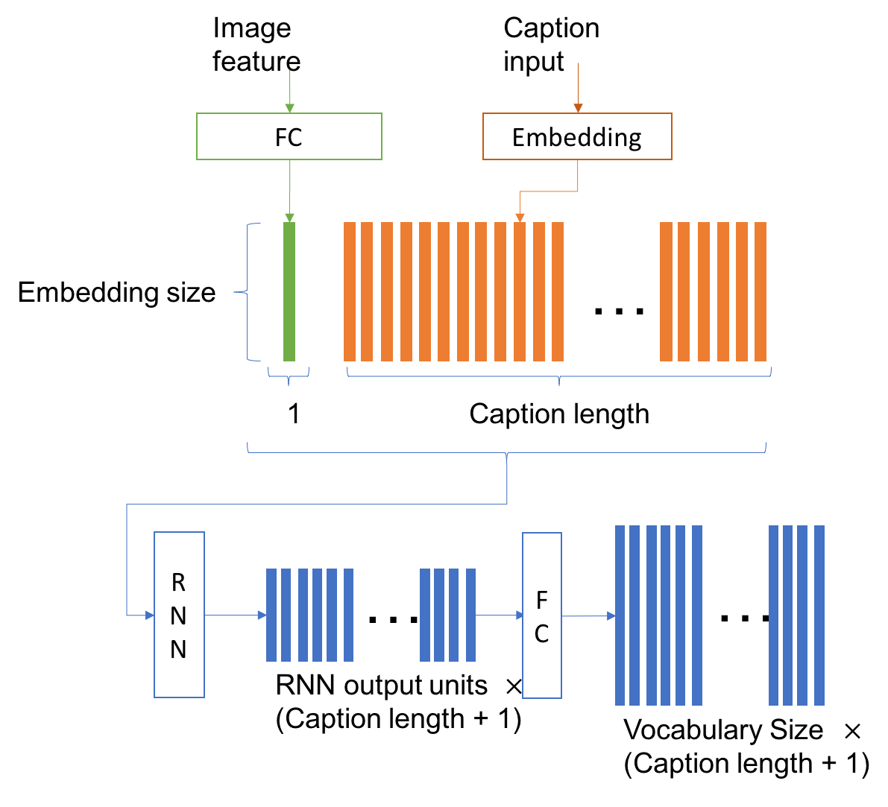
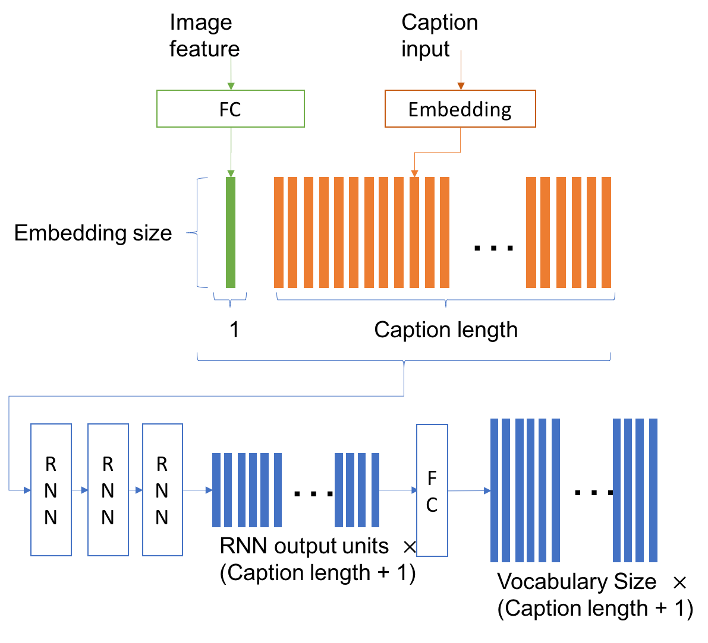
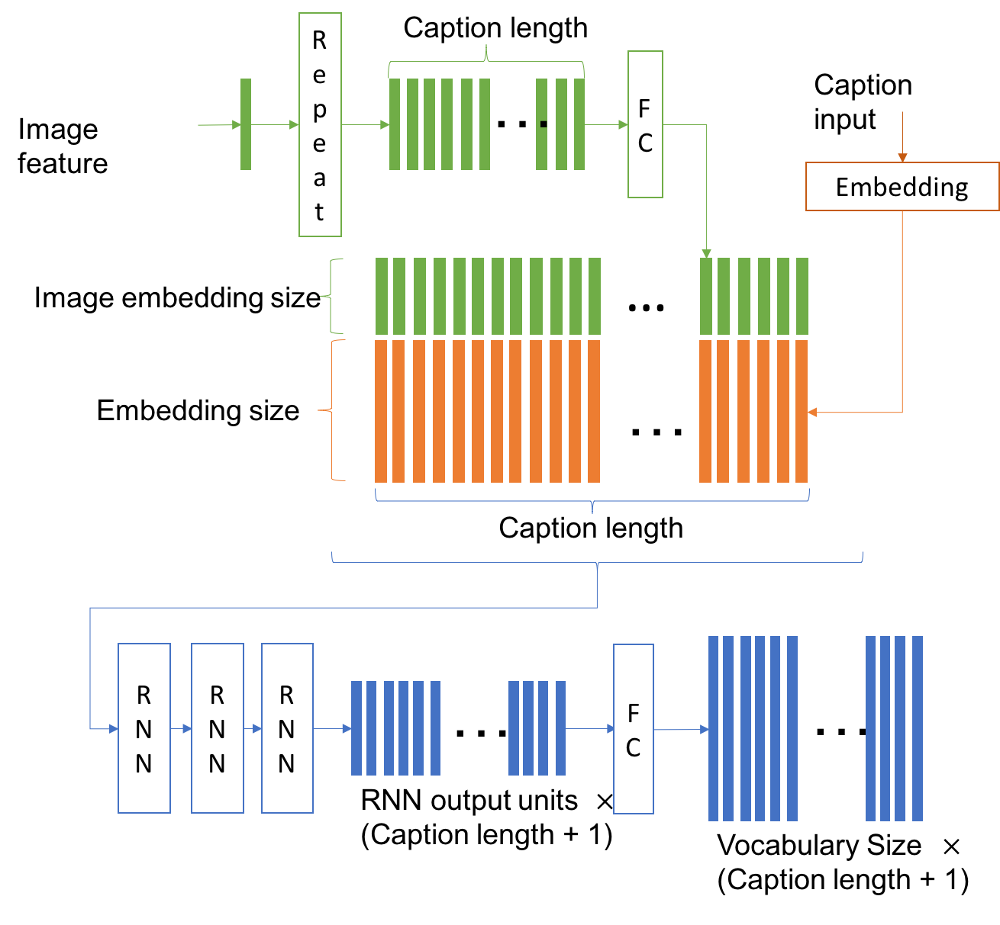

# 不同版本的说明

## 下载

所有版本的下载：[下载](https://github.com/chendagui16/xxxxx/releases)

## 说明

对于每一个实验，我们都在caption的前后添加了特定的开始符号和停止符号。在进行推断的时候，均采用了beam search的方式， 其中为了节约计算时间， beam search的大小设置为3。

由于在第一个版本中测试发现，使用beam search的方式能够比使用greedy的方法在belu的得分上好几个点，所以后续版本的实验均采用了beam serach的方式。

以下的任务中，使用的RNN除了v1.0使用的是GRU外，其他版本均采用LSTM。

另外，根据统计，大部分的caption长度都在40以下，最长的是50，较多的caption长度均在15左右，为了减少训练量，我们在数据预处理的时候就对长度进行了限制，超过规定长度的caption我们采取的截断的处理方式。

另外，由于图片对应的caption的数量不一样，有的图片只标注了一个caption， 有的标注了5个， 为了使训练时的数据平衡，我们在每一个epoch内，对每一个图片只随机采样一个caption进行训练。

**注意：为了能够多尝试不同的结构和不同的feature， 我们对每一个版本都没有做太多的调试，大部分都只调了两三次参数，有的就只搞了一个实验，所以这里的结果并不一定是所在版本的最好结果，只能作为参考**

## 版本图示

### v1.0

这里对Image feature(fc2)进行简单的处理，过一层fc层，然后就得到了图像的编码， 为了是使得图像输入和caption的输入能够concatenate成一个序列， 因此分别将图像和caption映射成同样的维度。

参考文献[show and tell](https://arxiv.org/pdf/1411.4555)我们仅仅将图像的信息放在RNN的输入第一个时刻。文献中提到，这样可以减少对图像数据的过拟合。为了加快训练速度，并减少训练过拟合，这里的Embedding size和RNN output units均采用较小的值。具体参数参见下表：

| Embedding size | Caption length | RNN output units |
| :------------: | :------------: | :--------------: |
|      128       |       30       |       128        |

我们在v1.0的版本上只试验了两次，分别测试了由greedy method和beam search产生的结果。其中用beam search的结果会在belu上高出几个点，其中使用beam search的结果如下。

| belu1 | belu2 | belu3 | belu4 | rouge | cider |
| :---: | :---: | :---: | :---: | :---: | :---: |
| 0.624 | 0.49  | 0.38  | 0.295 | 0.474 | 0.893 |

### v2.0

2.0 相比1.0 的主要改动是完善了代码，增加了很多使用的接口，可以直接通过一个脚本修改参数，并进行实验。另外也测试了使用卷积层的feature进行训练的结果，但是使用卷积层进行训练能够在训练集和验证集上得到较好的精度，却在belu的测试上得到较差的结果，这个原因，我们还没有研究清楚。我们猜测，这是因为卷积层的feature更靠近输入端，训练容易过拟合，然后由于对语言模型训练的较好，所以仍然能够得到较高的精度，但是这样产生的数据与图像失去了关联。在推断时，由于没有了直接的caption的输入，因此导致了推断时的误差。

因此，在这之后的实验，我们均采用了fc2的特征进行训练，虽然之后也一直在测试fc1和卷积层的特征，但是均没有达到fc2的效果，这里我们只显示利用fc2的结果。

另外v2.0使用了多层RNN，这里使用3层RNN的结构。测试较好的结果参数如下

| Embedding size | Caption length | RNN output units |
| :------------: | :------------: | :--------------: |
|      256       |       30       |       256        |

测试的结果如下

| belu1 | belu2 | belu3 | belu4 | rouge | cider |
| :---: | :---: | :---: | :---: | :---: | :---: |
| 0.644 | 0.512 | 0.398 | 0.31  | 0.485 | 1.005 |

### v3.0

3.0版本的主要改动是想要把图像的信息每一个时刻都输入进去，这里我首先想到了利用RNN将图片的feature进行编码，让网络自动学会在不同的时刻提取不同的图片信息。这样做，理论上来说，有这样一些好处：

* 放开了图片的embedding维度和caption的embedding维度相同的限制，可以更加灵活的设计网络的参数。
* 网络产生caption的每一个时刻都有图片的信息，加强caption与图片之间的关系。
* 这样的设计类似于取消了mask的attention机制，能让网络自动学会何时应该提取到图片中的相关信息。

> 注意到，这里我们原本是想引入attention的机制，但是觉得获得的feature map太小，而且不能用原始图像进行fine tuning，感觉效果不会特别好。（这里没有进行实验）

参数的设置如下表

| Image embedding size | Embedding size | Caption length | RNN output units |
| :------------------: | :------------: | :------------: | :--------------: |
|         128          |      256       |       35       |       512        |

这个版本的训练结果，我个人是觉得最好的，它能产生很多长的逻辑清楚的句子。但是belu的结果却较低，这里的原因我们也不是很清楚，可能是训练的问题。

由于3.0版本和4.0版本是同时进行的，4.0版本得到了较好的结果，由于GPU和时间有限，所以我们这里就没有调节参数， 搁置的3.0版本的工作，如果之后有时间会继续完善。

这个版本的测试结果如下

| belu1 | belu2 | belu3 | belu4 | rouge | cider |
| :---: | :---: | :---: | :---: | :---: | :---: |
| 0.623 | 0.489 | 0.376 | 0.29  | 0.471 | 0.906 |

### v4.0

4.0版本和3.0版本几乎一样，但是把编码的过程替换成了全连接层，与之不同的是，全连接层在不同的时刻没有共享参数（RNN在不同的时刻，参数是共享的）。我们觉得使用全连接网络进行编码，时间的相关性不强，为了弥补这样的相关性信息损失，我们扩大了Image embedding size。 参数如下

| Image embedding size | Embedding size | Caption length | RNN output units |
| :------------------: | :------------: | :------------: | :--------------: |
|         256          |      256       |       35       |       512        |

结果如下

| belu1 | belu2 | belu3 | belu4 | rouge | cider |
| :---: | :---: | :---: | :---: | :---: | :---: |
| 0.672 | 0.534 | 0.419 | 0.326 | 0.508 | 1.095 |

## 小结

* 多层的RNN要好于单层的RNN

* 过多的设计可能会带来反效果

* 没有最好的结构，只有合适问题的结构，针对特定的问题设计特定的结构

  ​